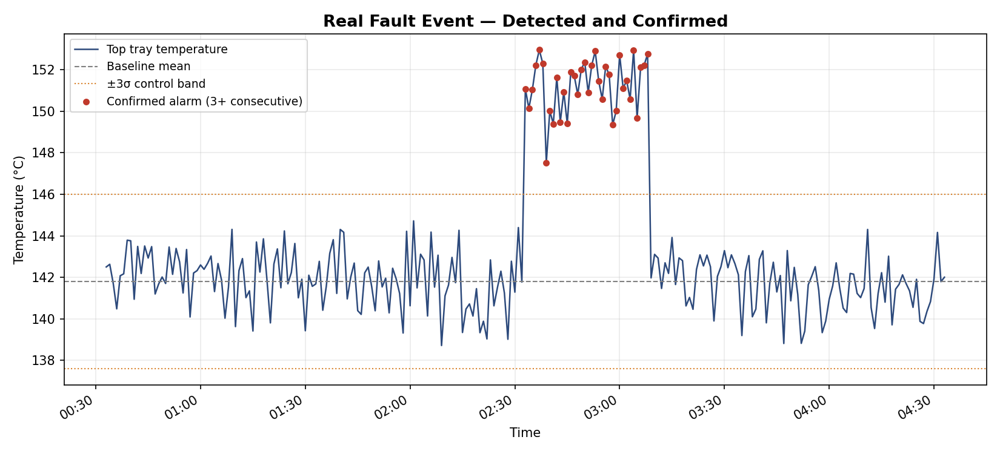
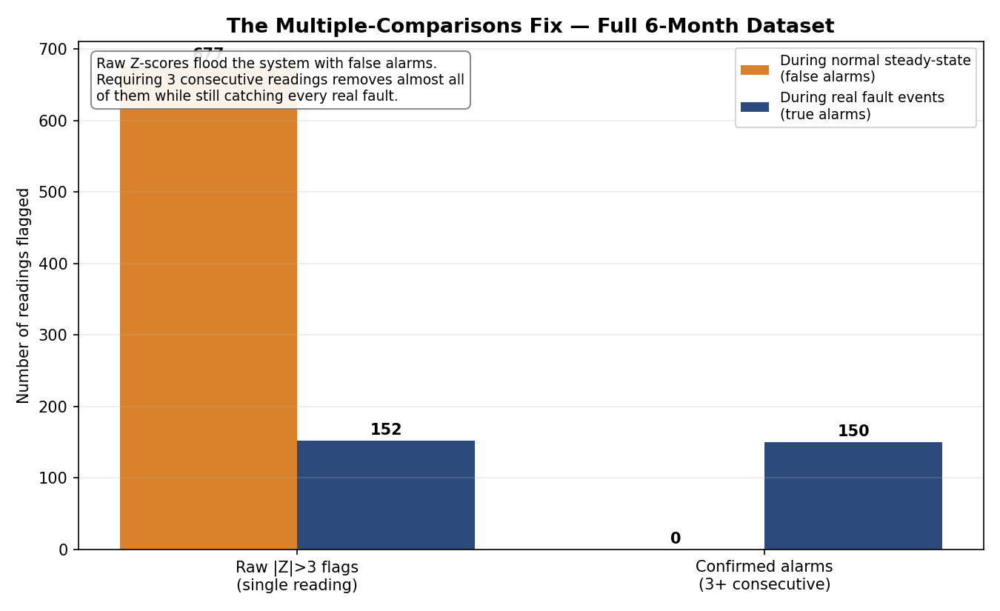

# Distillation Column Anomaly Detector

A statistically rigorous Z-score anomaly detector for industrial sensor data,
built around one core lesson: **a mathematically correct 3-sigma threshold
will still flood operators with false alarms if you don't account for how
often you're checking it.**

This project simulates 6 months of distillation column temperature data
and shows, with real numbers, how a single fix — requiring consecutive
flagged readings before alarming — reduces false alarms by **100%** in this
dataset while still catching **every real fault**.

---

## The Problem

Industrial sensors are read constantly — often every minute. At a
"safe" 3-sigma threshold (99.73% of normal readings fall inside it),
you'd expect a 0.27% false-alarm rate per reading. That sounds small.

It isn't, once you account for how many times you're actually checking:

```
1 sensor x 1 reading/minute x 1440 minutes/day x 30 days = 43,200 checks/month
43,200 x 0.27% ≈ 117 false alarms/month, from a "correct" threshold alone
```

This is the **multiple-comparisons problem** — a small false-positive rate,
multiplied by enough opportunities to fail, guarantees frequent false alarms.
It is rarely mentioned alongside the basic Z-score formula, but it is the
difference between a detector that gets switched off by frustrated operators
and one that survives in production.

## The Fix

Require **N consecutive** flagged readings before raising a real alarm,
instead of alarming on any single flagged point.

```
Single-reading false-alarm rate:        0.27%
3-consecutive-reading false-alarm rate: 0.27%^3 ≈ 0.0000002%
```

Isolated sensor noise rarely repeats three times in a row. A genuine,
sustained process fault does. This single change collapses the false-alarm
rate by orders of magnitude while barely affecting real-fault detection.

## Results on Simulated Data

| Metric | Value |
|---|---|
| Steady-state baseline | mean = 141.80°C, std = 1.401°C (n = 257,005, ddof=1) |
| Real fault events injected | 6 |
| Real fault events caught (3+ consecutive) | **6 / 6** |
| Raw single-point false alarms (steady-state) | 677 |
| Confirmed false alarms after the fix | **0** |
| False-alarm reduction | **100%** |


*A real injected fault: temperature shifts ~7 standard deviations above
baseline, sustained for 35 minutes. Flagged and confirmed correctly.*


*Across the full 6-month dataset: raw Z-score flags create hundreds of
false alarms during normal operation. Requiring 3 consecutive readings
removes effectively all of them while still catching every real fault.*

---

## Methodology — The Production Checklist

1. **Filter to steady-state using domain knowledge first**, not statistics.
   Startup and shutdown periods are excluded using process knowledge
   (here, simulated regime labels) *before* any baseline is computed —
   avoiding the circular problem of needing clean statistics to find
   outliers, and needing outlier-free data to compute clean statistics.

2. **Compute baseline mean and standard deviation with `ddof=1`**
   (Bessel's correction) — the steady-state data is a sample, not the
   full population of all possible operating conditions.

3. **Flag any reading with `|Z| > 3`** as a candidate anomaly.

4. **Require 3 consecutive flagged readings** before confirming a real
   alarm — the fix for the multiple-comparisons problem above.

## Project Structure

```
distillation-anomaly-detector/
├── generate_data.py    # simulates 6 months of realistic sensor data
├── detector.py          # the Z-score detector + consecutive-reading fix
├── visualize.py          # produces both result plots
├── historian_data.csv     # generated raw data (git-ignored if large)
├── scored_data.csv         # data with Z-scores and alarm flags
├── plot_1_fault_detection.png
└── plot_2_multiple_comparisons_fix.png
```

## Running It

```bash
pip install numpy pandas scipy matplotlib

python generate_data.py   # creates historian_data.csv
python detector.py         # creates scored_data.csv, prints summary
python visualize.py         # creates the two PNG plots
```

## Why This Matters Beyond Temperature Sensors

This exact pattern — a statistically correct threshold producing
unacceptable false-alarm rates purely due to checking frequency — appears
everywhere monitoring is done continuously: fraud detection systems,
server health monitoring, medical device alarms, and any Digital Twin
performing real-time state estimation. The fix (requiring sustained
evidence, not single-point triggers) generalises directly.

## Background

Built while studying the mathematical foundations behind industrial
Digital Twins and soft sensors — connecting basic statistics (mean,
variance, Z-scores) to the production engineering decisions that
determine whether a monitoring system actually gets trusted and used
by plant operators.

This same inverse-variance-weighting logic — trusting a more precise
sensor more, but never discarding a noisier one entirely — is what
the Kalman Gain computes automatically inside an Extended Kalman Filter
or Ensemble Kalman Filter used for state estimation in physical systems.
